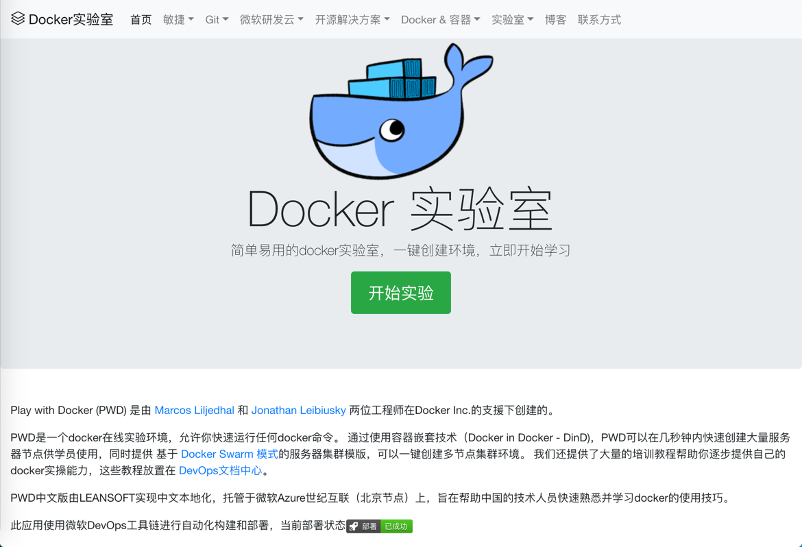

# Docker实验室 play-with-docker

Play with Docker (PWD) 是由 Marcos Liljedhal 和 Jonathan Leibiusky 两位工程师在Docker Inc.的支援下创建的。

PWD是一个docker在线实验环境，允许你快速运行任何docker命令。 通过使用容器嵌套技术（Docker in Docker - DinD)，PWD可以在几秒钟内快速创建大量服务器节点供学员使用，同时提供 基于 Docker Swarm 模式的服务器集群模版，可以一键创建多节点集群环境。 我们还提供了大量的培训教程帮助你逐步提供自己的docker实操能力，这些教程放置在 DevOps文档中心。

PWD中文版由LEANSOFT实现中文本地化，托管于微软Azure世纪互联（北京节点）上，旨在帮助中国的技术人员快速熟悉并学习docker的使用技巧。

中文本地版Docker实验室地址 http://play-with-docker.cn

本开源项目使用 Azure Pipeline 进行自动化构建，打包和部署；容器镜像托管于 Azure Container Registry。

[](https://dev.azure.com/leansoftx/play-with-docker/_build/latest?definitionId=9) [](https://dev.azure.com/leansoftx/play-with-docker/_release?view=mine&definitionId=2)



## 系统需求

Docker 环境版本 1.13 以上。

需要在Docker上启用Swarm Mode因为PWD使用overlay网络处理实验环境之间的网络通信，建议使用docker-machine建立独立的docker主机作为运行环境，不要和其他容器环境混合使用。

运行一下脚本创建运行环境

```shell
# 创建独立的docker-machine主机
docker-machine create pwd-host
# 将docker客户端连接到docker-machine主机
eval $(docker-machine env pwd-host)
# 启用docker swarm模式
docker swarm init
# 远程进入docker-machine
docker-machine ssh pwd-host
# 加载IPVS kernel module以便使用 dind (docker in docker)
sudo modprobe xt_ipvs
# 获取dind环境镜像文件
docker pull franela/dind
```

## 开发调试环境搭建

使用以下方式创建你的本地开发调试环境。

1) Install go 1.7.1+ with `brew` on Mac or through a package manager.

2) Install [dep](https://github.com/golang/dep) and run `dep ensure` to pull dependencies

3) Start PWD as a container with docker-compose up.

4) Point to http://localhost and click "New Instance"

说明:

* There is a hard-coded limit to 5 Docker playgrounds per session. After 4 hours sessions are deleted.
* If you want to override the DIND version or image then set the environmental variable i.e.
  `DIND_IMAGE=franela/docker<version>-rc:dind`. Take into account that you can't use standard `dind` images, only [franela](https://hub.docker.com/r/franela/) ones work.
  
### Port forwarding

In order for port forwarding to work correctly in development you need to make `*.localhost` to resolve to `127.0.0.1`. That way when you try to access to `pwd10-0-0-1-8080.host1.localhost`, then you're forwarded correctly to your local PWD server.

You can achieve this by setting up a `dnsmasq` server (you can run it in a docker container also) and adding the following configuration:

```shell
address=/localhost/127.0.0.1
```

Don't forget to change your computer default DNS to use the dnsmasq server to resolve.

### Building the dind image myself.

If you want to make changes to the `dind` image being used, make your changes to the `Dockerfile.dind` file and then build it using this command: `docker build --build-arg docker_storage_driver=vfs -f Dockerfile.dind -t franela/dind .` 

## FAQ

### How can I connect to a published port from the outside world?


If you need to access your services from outside, use the following URL pattern `http://ip<hyphen-ip>-<session_jd>-<port>.direct.labs.play-with-docker.com` (i.e: http://ip-2-135-3-b8ir6vbg5vr00095iil0-8080.direct.labs.play-with-docker.com).

### Why is PWD running in ports 80 and 443?, Can I change that?.

No, it needs to run on those ports for DNS resolve to work. Ideas or suggestions about how to improve this
are welcome
